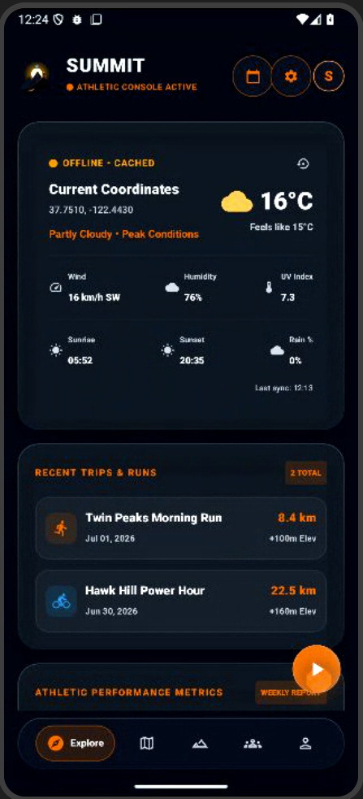
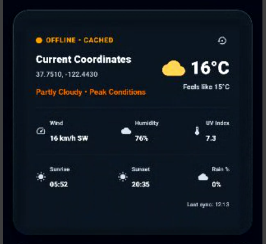
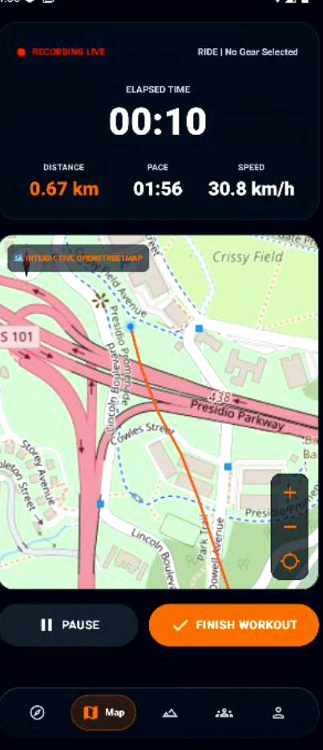
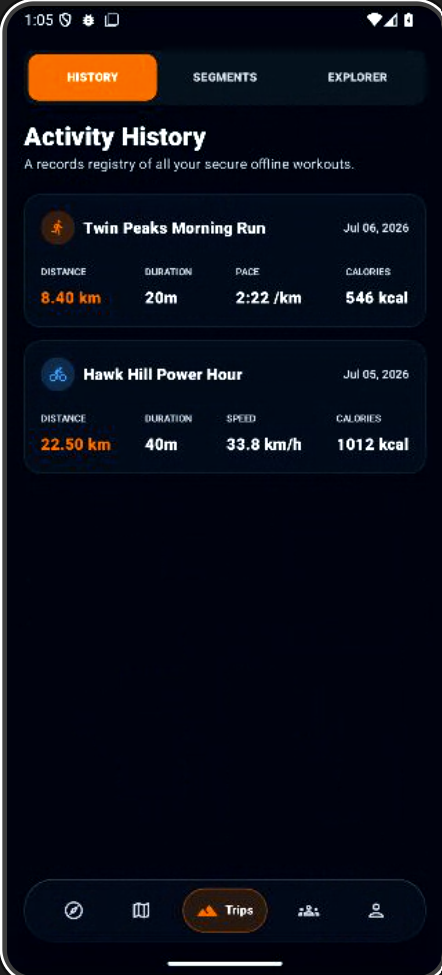

# 🏔 Summit

### Premium Outdoor Fitness & Hiking Tracker

Track hikes, runs, and walks with real-time GPS, offline maps, weather integration, and detailed activity analytics.

  
  
  
  
  

────────────────────────────────────────────

           🏔 SUMMIT

Outdoor Fitness & Hiking Tracker

GPS • Offline Maps • Hiking • Analytics

────────────────────────────────────────────

## 📖 About

Summit is a premium Android outdoor fitness application inspired by Strava and AllTrails.

It enables users to track hiking, running, and walking activities with real-time GPS recording, offline OpenStreetMap support, weather integration, GPX import/export, and detailed performance analytics.

The app is built using modern Android development practices including Jetpack Compose, MVVM architecture, and Room Database.

 🌟 Highlights

- 🛰️ Real-time GPS tracking with intelligent filtering
- 🗺️ Offline OpenStreetMap integration
- 🥾 Hiking, Running, and Walking activity modes
- 🌦️ Built-in weather dashboard with offline cache
- 📊 Activity history with performance analytics
- 📂 GPX import and export support
- 💾 Room Database for offline storage
- 🎨 Modern Material 3 user interface

## 📱 Screenshots
## 📱 Screenshots

  
  

  
  

##
 ## 🛠 Tech Stack

### Android

- Kotlin
- Jetpack Compose
- Coroutines
- Material 3

### Architecture

- MVVM
- Repository Pattern

### Database

- Room

### Maps

- OpenStreetMap (osmdroid)

### APIs

- Weather API
- Fused Location Provider

## 🚀 Roadmap

- [x] GPS Tracking
- [x] Hiking
- [x] Running
- [x] Walking
- [x] Offline Maps
- [x] GPX Import
- [x] GPX Export
- [x] Weather

### Planned

- [ ] Cloud Sync
- [ ] Wear OS Support
- [ ] AI Coach
- [ ] Social Sharing

## 👨‍💻 Developer

**Vinith Reddy**

🌐 Portfolio  
https://vinithreddy.vercel.app

💻 GitHub  
https://github.com/Vinithreddy279
